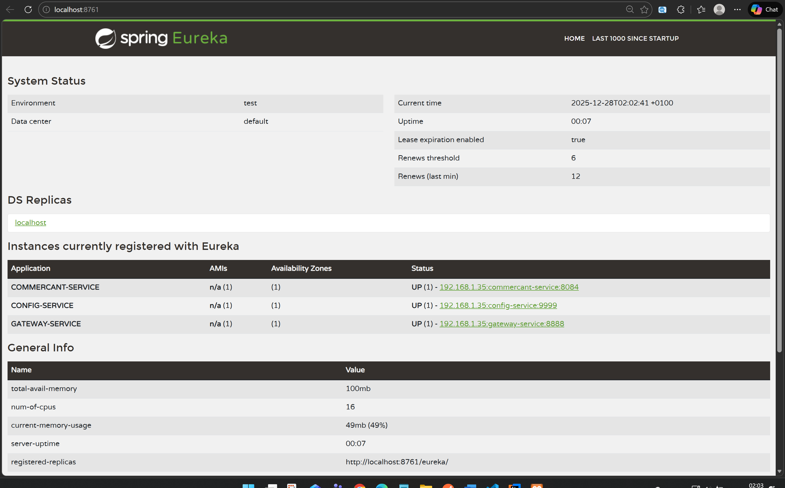
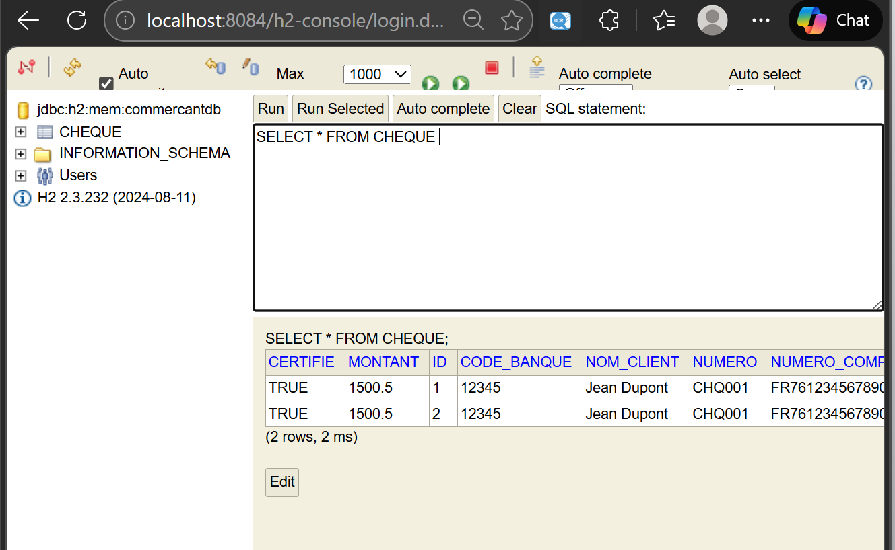
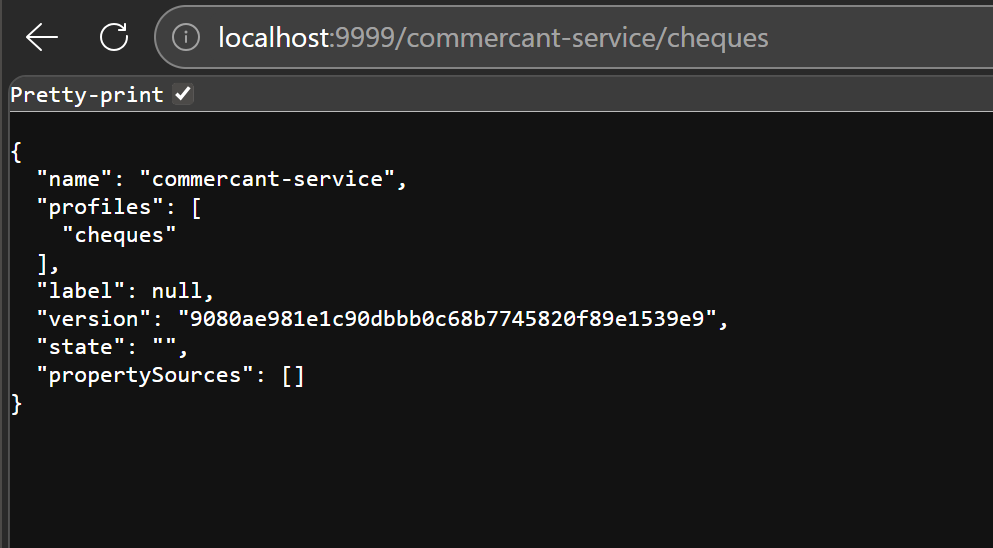
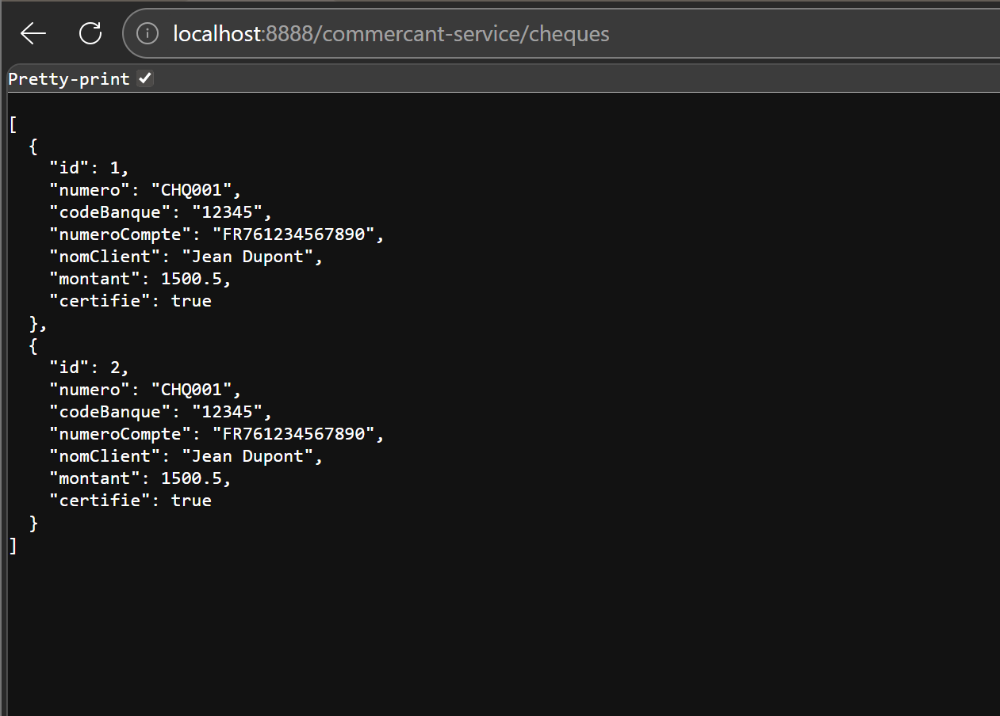

# pour le frontend on essaie de le créer via la commande :

### Angular CLI
Installation (si pas encore) :
```bash
npm install -g @angular/cli
```
### Créer le projet Angular
```bash
ng new frontweb-app
```

### Lancer le serveur Angular
```bash 
cd frontweb-app
```
```bash 
ng serve 
```
## Créer un service Angular pour communiquer avec le backend
```bash
ng generate service services/cheque
```
 
## Etape 1 création de tout les services dès le départ

## Etape 2 Développer et tester les micro-services , Discovery-service , Gateway-service et config-service

pour config-service on ajoute la notation de @EnableConfigServer bien sur on modifie le pom on modifie le application properties aussi 
pour discovery-service on met @EnableEurekaServer
pour gateway-service on pose dans la classe GatewayServiceApp
```bash
@Bean
DiscoveryClientRouteDefinitionLocator locator(
ReactiveDiscoveryClient rdc, DiscoveryLocatorProperties dlp){
return new DiscoveryClientRouteDefinitionLocator(rdc,dlp);
}
```

il faut faire attention dans discovery-service gatway-service et config service la version de gspring doit etre <version>3.5.7</version>

ordre de démarrage 
```bash
1. Discovery Service (Eureka)
2. Config Service
3. Gateway Service
4. Microservices métiers
5. Tests d’intégration et de routage
```


on commence par tester
Accéder à Eureka Dashboard


insertion fait dans la base de donné


test avec configservice


test avec application gateway



